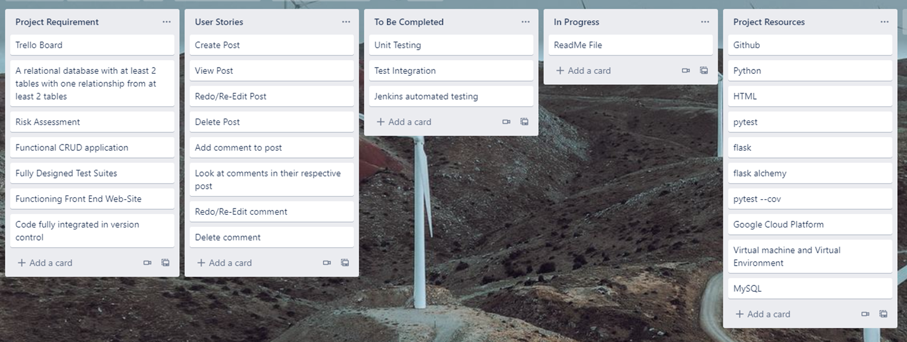
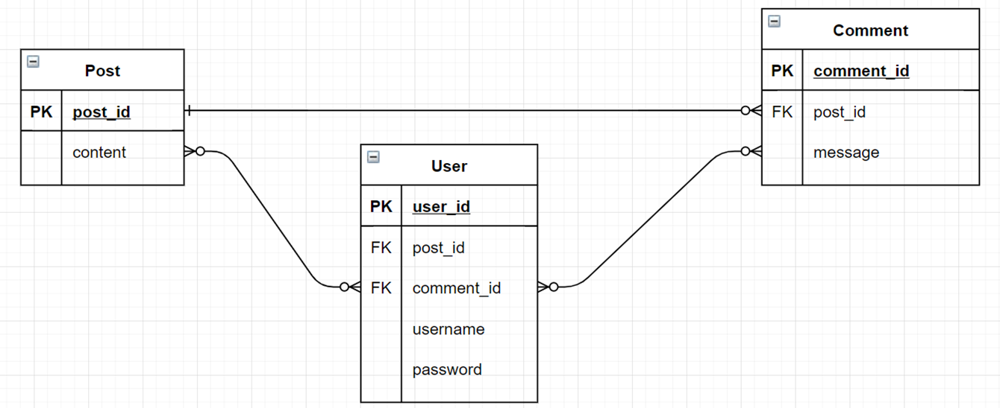
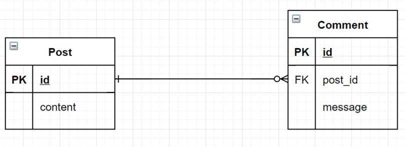
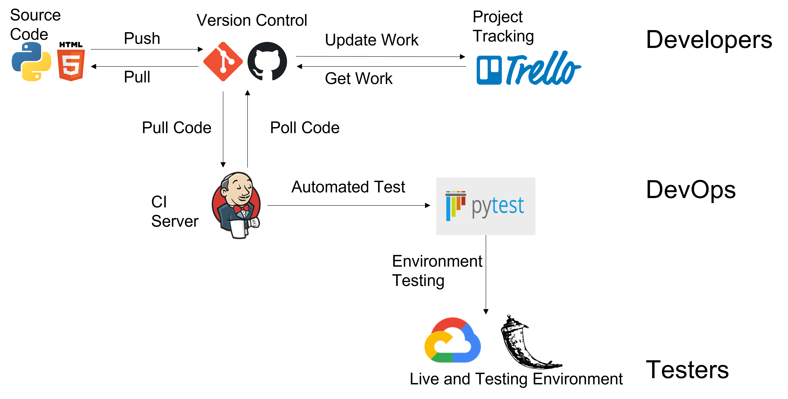
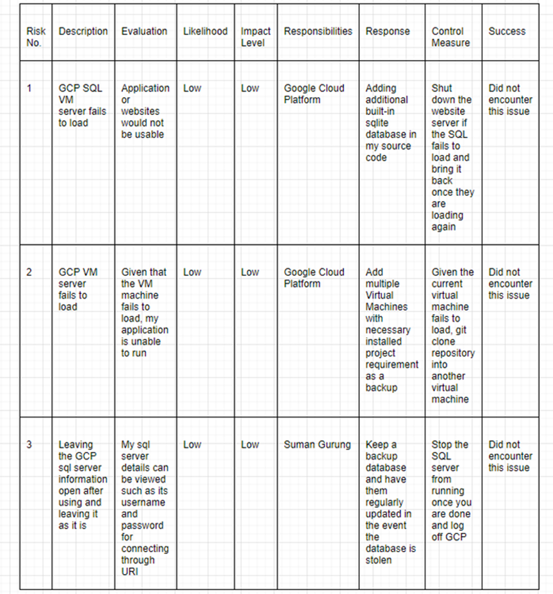
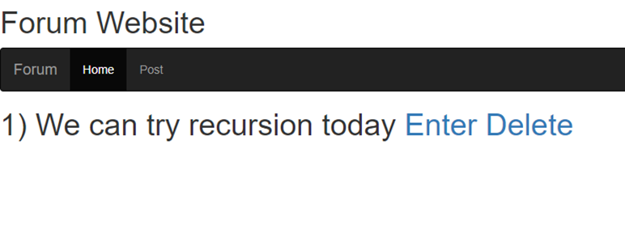
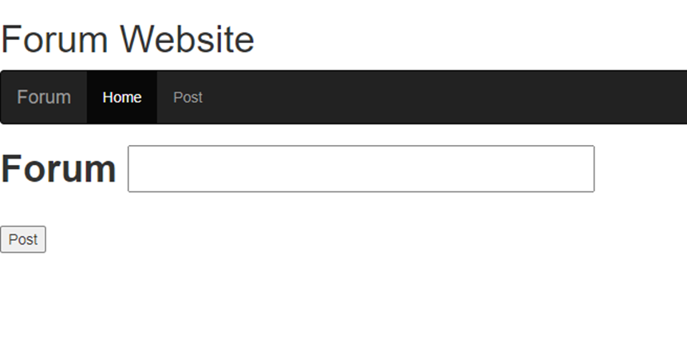
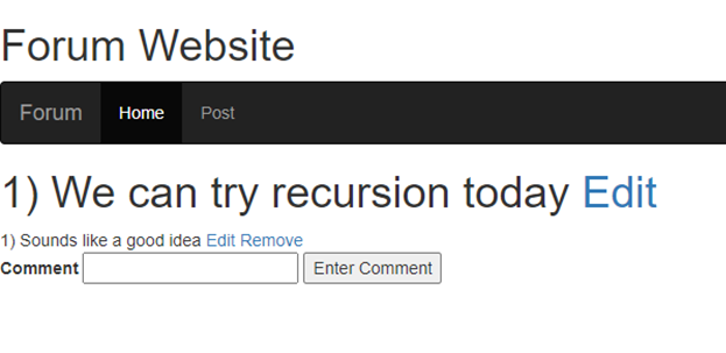
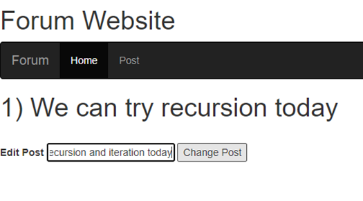
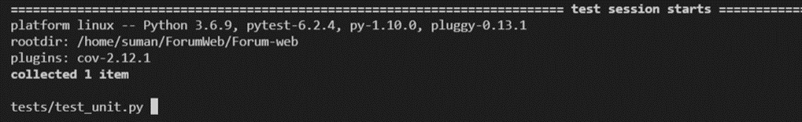

# Forum-web

## Introduction
For my project I decided to make a Forum Website where users can share a post about an idea they would like to discuss or raise an issue. Other users can then view the post and add their own comment to give their opinions to discuss about the post. 

The following is how my CRUD functionailty will be implemented.

Create:
* A brand new post
* A new comment in a post that have already been created

Read:
* Any posts that have already been created
* Any comments that have already been created

Update:
* Any posts that have already been created
* Any comments that have already been created

Delete:
* Any posts that have already been created
* Any comments that have already been created

## Software Design

### Project Tracking board
I used a trello app to track progress in my project.

Trello board can be found in https://trello.com/b/89x8nLvF/qa-project

### Entity Relationship Diagram
For the first draft of desgining my Entity Relationship Diagram (ERD), I started with three entities. The following image is what my entity relationship digram looked like.

I then decided to change it since I realised that there was no longer going to have a user log-in feature in the application. I found out about this on 13/07/2021 after a one-to-one meeting with Olver Nichols. A user profile and user login details would no longer be required, therefore I decided to get rid of the entity on that day.

For the new entity relationship digram I decided to remove the user entity and its relationships towards other entities. This means that any user can use the app without any sign-up or registration.

With my new entity relationship, it is a one to many relationship where a single post can contain one or many comments while an individual comment belongs to one post. 

This ERD would then ensure that user must require a post to be created before they can start creating a comment. 

### User Story
Looking at an end-user point of view, there are objectives that matters to end-users. The following user stories explores the end-goal that a user would like to obtain at first glance. 

First User Story
* As a User
* I want to create a post
* So that I can share a new idea to other users

Second User Story
* As a User
* I want to create a comment on a post
* So that I can discuss and share my ideas on a post I picked

Third User Story
* As a User
* I want to view all the posts
* So that I can pick the post I want to discuss about

Even though the above user story seems sufficient, I noticed it lacked update and delete features for my CRUD application. Since the above user story covers the create functionality, user story regarding the update and delete functionality can be built. Then I decided to have more user stories that would involve update and delete features resulting in the following user story.

Fourth User Story
* As a User
* I want to re-edit a created post
* So that I can fix any spelling errors or add additional information on the post

Fifth User Story
* As a User
* I want to re-edit a created comment
* So that I can fix any spelling errors or add additional information on the comment

Sixth User Story
* As a User
* I want to delete a created post
* So that I can either consider its issue or discussion to be solved or consider it to be no longer productive/useful

Seventh User Story
* As a User
* I want to delete a created comment
* So that I can remove it given that it isn't a helpful suggestion

Finally I remembered that the comments should be viewed at a relavent place rather than a random home page. Therefore the user story below should sufice 

Eigth User Story
* As a User
* I want to view all comments of a post
* So that I read discussion of the post from other users

### CI Pipeline
CI pipeline is a digram for continous integration where it contains all the necessary tools for allowing automated code testing.

### Risk Assessment 
I started off with the following risk assessment which mainly consisted of the reliability of Google Cloud Platform server.

Then once I started to code my project, I have added additional risks I may encounter in running my application. 

Risk assessment and Entity Relationship Digrams can be accessed at https://app.diagrams.net/ using the file in https://drive.google.com/file/d/1MhEYqQFj3dJx40I6dAXWNR_LPEyeze-v/view 
### Front-end
The image below is a home page where you can view posts that have already been created. Also you can choose posts to view their full forum page which includes comments. Apart from that, there is option to delete a post you choose as well.

Pressing the post navigation bar allows you to head over to a page that lets you create a post.

Once you choose to view a certain post, you are able to view a full forum page of that post which includes comments. In this page, it allows comments to be written and also re-rewrite the post and any comments. Comments can be removed in this page but the post cannot be removed so the forum page remains. Post can only be removed in the home page

There is also a seperate page that rewrites post that have already been created. Comment is also re-written in similar way.

### Unit Testing
For the unit testing I attempted to use pytest for testing my test cases. However the pytest would'nt execute the test and would keep on loading. Therefore I was unable to carry out further tests such as integration test and jenkins testing.

### Improvements needed
Having coverage test results would ensure the validity of my app. Also unit testing, test integration would be required for improvements. 

Running jenkin tests would be benificial to run automated tests.

I would like to have a user login features added onto the website in the future. Having a user profile makes it easier for communication to take place in my app.

Also different types of flask form input fields such as SelectField would be a great addition to the app. This will provide more well rounded interaction of user interface. For instance user can have the option to select certain posts in certain user profile or own user profile.

Using more bootstrap to my html templates would make my web page more appealing.

### Author
Suman Gurung

### Acknowledgement
Ryan Wright
Oliver Nichols

